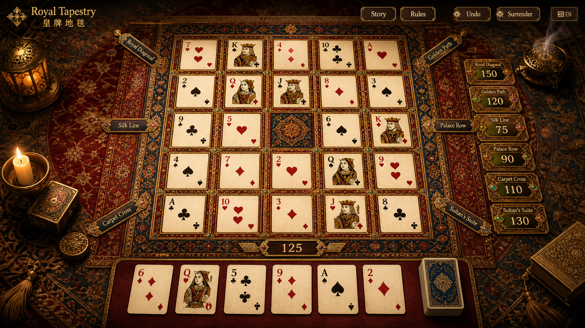
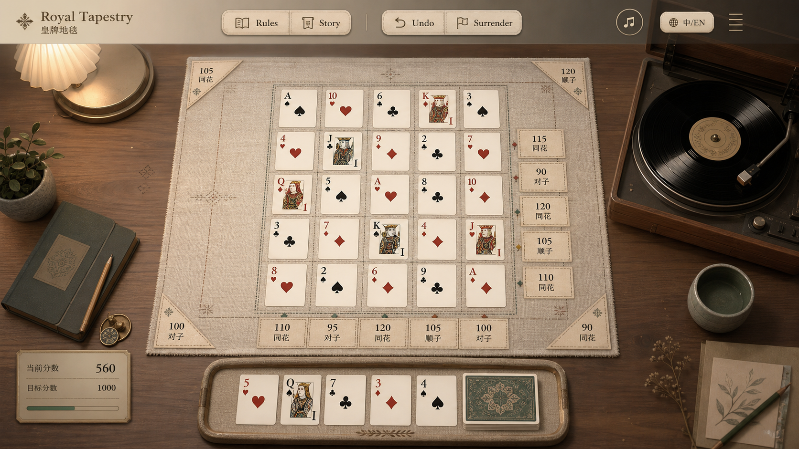
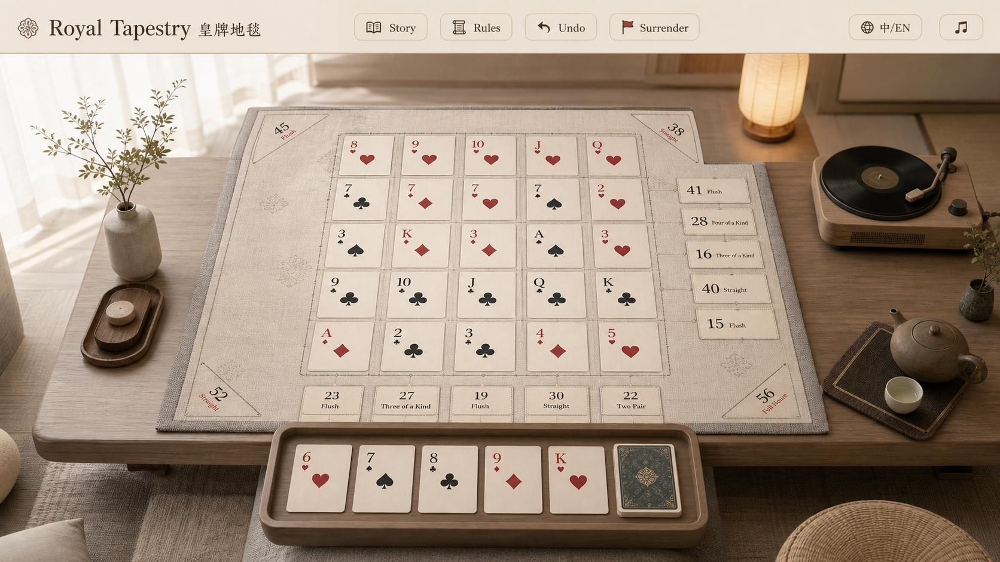
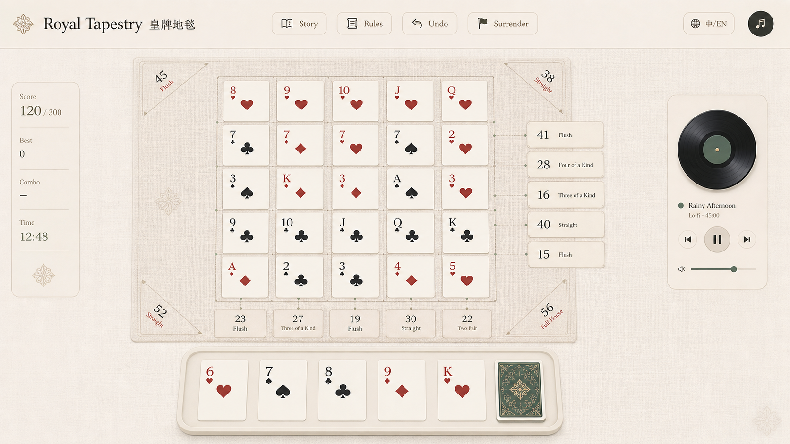

# Art Direction Notes

## UI Concept Reference

Generated on 2026-05-13 as a visual reference for future full-interface UI iteration.



## Minimal UI Concept Explorations

These references explore a lighter and more casual visual direction: the player is not inside the legend, but is playing an inherited old card puzzle in a calm present-day space.

### Quiet Desk



- Modern desk or low table as the main stage.
- Cloth mat and paper cards carry the inherited-game feeling without turning the scene into fantasy.
- Vinyl player can become a quiet music controller, but should stay secondary to the board.
- Best suited for a durable everyday interface if the final UI keeps enough whitespace and avoids over-rendered props.

### Modern Low Table



- Softer, more lifestyle-oriented than the desk direction.
- Low table, pale wood, linen, and open space make the game feel slower and more pause-friendly.
- Good reference for a mobile-friendly atmosphere because the visual system can collapse into a simple cloth-mat surface.
- Risk: if pushed too far, the game may feel generic or lose the distinct Royal Tapestry identity, so card backs, labels, and subtle woven motifs need to carry the brand.

### App-Like Ritual



- Closest to a practical web-app UI direction.
- Uses the board, hand tray, score labels, and small music widget as the main composition instead of a realistic room.
- Good reference for spacing, control hierarchy, and a calmer long-session product feel.
- Risk: if it becomes too abstract, the inherited-game feeling may disappear. Keep subtle cloth texture, card-back motifs, and quiet brass or ink details.

### Minimal Direction Comparison

- `Quiet Desk`: strongest atmosphere and easiest place for vinyl music, but may become too prop-heavy.
- `Modern Low Table`: calmest lifestyle mood, but needs extra identity details to avoid becoming generic.
- `App-Like Ritual`: most implementable as UI, but needs tactile detail so it does not become sterile.

For a first real UI iteration, start from `App-Like Ritual` for structure, borrow warmth and music placement from `Quiet Desk`, and borrow whitespace and softness from `Modern Low Table`.

### Direction

- Treat the game as a slow, tactile tabletop puzzle rather than a casino card game.
- Use the royal carpet as the core visual metaphor: the board, score plaques, labels, and atmosphere should feel woven into one object.
- Keep the board and cards readable before adding ornament.
- Let decorative detail live around the interaction surface, not on top of the functional card faces.
- Favor warm lamplight, brass, deep red, ivory, black ink, lapis, silk thread, and subtle emerald accents.
- Avoid neon casino styling, generic mobile game panels, oversized marketing text, and heavy glassmorphism.

### Useful Prompt Seed

```text
Create a polished concept art image for a slow, elegant card puzzle game interface titled "Royal Tapestry / 皇牌地毯".

The screen shows a square tabletop puzzle board inspired by an ornate Middle Eastern royal carpet. Playing cards are arranged on the carpet-like grid, forming rows, columns, and diagonals. Around the board are slim score plaques and small combination-name labels, integrated as embroidered tags or brass inlays rather than modern UI boxes. The hand cards sit below like carefully placed cards on fabric.

The whole interface should feel calm, luxurious, tactile, readable, and practical for a puzzle game.
```

### Iteration Checks

- Can a player immediately distinguish board cells, cards, hand area, score boxes, and controls?
- Does the visual language support drag-and-drop interaction without making the surface feel fragile?
- Do score boxes and combo labels feel like part of the carpet/table object?
- Does the style still leave room for mobile constraints?
- Is the atmosphere calm enough for a slow, interruptible game session?
